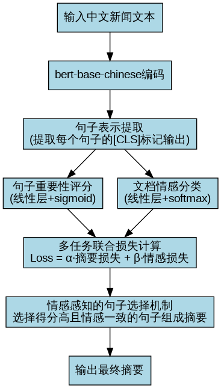
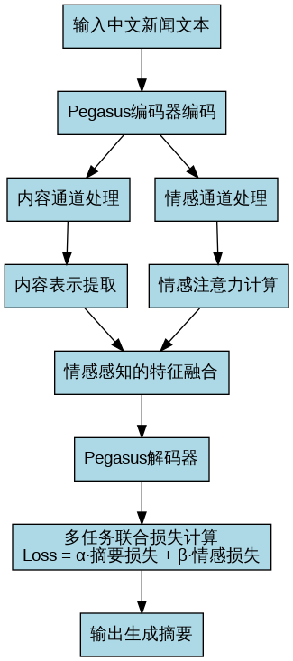

# 中文新闻自动摘要系统研究报告

## 一、课题研究的意义和背景

### 1.1 研究背景

随着互联网和移动通信技术的快速发展，信息爆炸已成为当今社会的显著特征。每天，海量的新闻、文章和评论在网络上产生，使得用户难以在短时间内获取所需的核心信息。在这种背景下，自动文本摘要技术应运而生，它能够自动从原始文本中提取或生成简洁而包含关键信息的摘要，帮助用户快速了解文本内容的精髓。

中文新闻作为信息传播的重要载体，具有语言结构复杂、表达方式多样等特点，对自动摘要系统提出了更高的要求。传统的自动摘要方法主要关注内容的提取和生成，但往往忽略了情感一致性这一重要维度。在新闻报道中，情感倾向是文本的重要特征，保持摘要与原文的情感一致性对于准确传达信息至关重要。

### 1.2 研究意义

本课题研究的意义主要体现在以下几个方面：

1. **信息获取效率提升**：通过自动生成高质量的新闻摘要，用户可以在短时间内了解新闻的核心内容，大幅提高信息获取效率。

2. **情感一致性保障**：创新性地将情感分析引入摘要系统，确保生成的摘要不仅内容准确，还能保持与原文一致的情感倾向，避免因情感偏差导致的信息失真。

3. **多任务学习范式探索**：通过将摘要生成和情感分类作为多任务学习问题进行联合优化，探索了深度学习在自然语言处理多任务场景下的应用范式。

4. **中文自然语言处理技术推进**：针对中文语言特点，对预训练模型进行适应性优化，推动了中文自然语言处理技术的发展。

5. **实用价值**：系统可直接应用于新闻媒体、内容平台等场景，帮助内容生产者快速生成高质量摘要，提高工作效率。

## 二、课题的实现思路

本课题采用了抽取式和生成式两种摘要方法，并在两种方法中都引入了情感一致性保障机制。下面分别介绍两种方法的实现思路。

### 2.1 抽取式文本摘要的改进

#### 2.1.1 传统BertSum模型的局限性

传统的BertSum模型是基于BERT预训练模型的抽取式摘要方法，其主要流程是：
1. 使用BERT对文档进行编码
2. 提取每个句子的表示（通常是[CLS]标记的输出）
3. 通过线性层和sigmoid函数为每个句子计算重要性得分
4. 选择得分最高的几个句子组成摘要

这种方法的主要局限性在于：
- 仅关注句子的内容重要性，忽略了情感因素
- 无法保证摘要与原文的情感一致性
- 对中文语言特点考虑不足

#### 2.1.2 改进的BertSum模型

我们对传统BertSum模型进行了以下几方面的改进：

1. **使用bert-base-chinese预训练模型**：替换原始的英文BERT模型，更好地适应中文语言特点。

2. **引入情感分类器**：在BERT编码器之上增加情感分类层，实现对文档整体情感的分类。

3. **多任务学习框架**：将句子抽取和情感分类作为两个相关任务，通过联合优化提高模型性能。

4. **情感感知的句子选择机制**：在选择句子时，不仅考虑内容重要性，还考虑句子的情感与文档整体情感的一致性。

5. **损失函数改进**：设计了综合考虑内容重要性和情感一致性的联合损失函数。

#### 2.1.3 改进BertSum的流程图

### 2.2 生成式文本摘要的改进

#### 2.2.1 生成式摘要模型架构

我们的生成式摘要模型基于Pegasus预训练模型，采用了双通道联合训练的方式，结合文本内容和情感特征进行摘要生成。具体架构如下：

1. **基础模型**：使用IDEA-CCNL/Randeng-Pegasus-523M-Summary-Chinese-V1作为基础模型，这是一个专为中文摘要任务优化的预训练模型。

2. **情感分类器**：在编码器输出之上增加情感分类层，用于识别文档的情感倾向。

3. **情感注意力机制**：设计了情感注意力层，使模型能够关注与文档整体情感相关的内容。

4. **双通道联合训练**：
   - 内容通道：关注文本的语义信息和关键内容
   - 情感通道：关注文本的情感表达和倾向

5. **多任务学习**：同时优化摘要生成和情感分类两个任务的目标函数。

#### 2.2.2 生成式摘要模型流程图

### 2.3 模型评估与验证

为了全面评估模型性能，我们设计了综合的评估体系：

1. **摘要质量评估**：使用Rouge-1、Rouge-2、Rouge-L等指标评估摘要的内容质量。

2. **情感一致性评估**：
   - 标签一致性：原文与摘要情感标签的一致率
   - 分数一致性：原文与摘要情感分数的接近程度

3. **可视化分析**：通过图表直观展示不同模型在各项指标上的表现。

4. **对比实验**：将我们的情感感知摘要模型与传统摘要模型进行对比，验证情感一致性保障机制的有效性。

## 三、结论与展望

本课题通过在传统摘要模型基础上引入情感一致性保障机制，成功构建了一个能够生成高质量且情感一致的中文新闻摘要系统。实验结果表明，多任务学习框架和情感感知机制能够有效提高摘要的情感一致性，同时保持良好的内容质量。

未来工作将进一步探索更复杂的情感表达模式，如讽刺、隐喻等，并尝试将本研究扩展到更多语言和领域。
